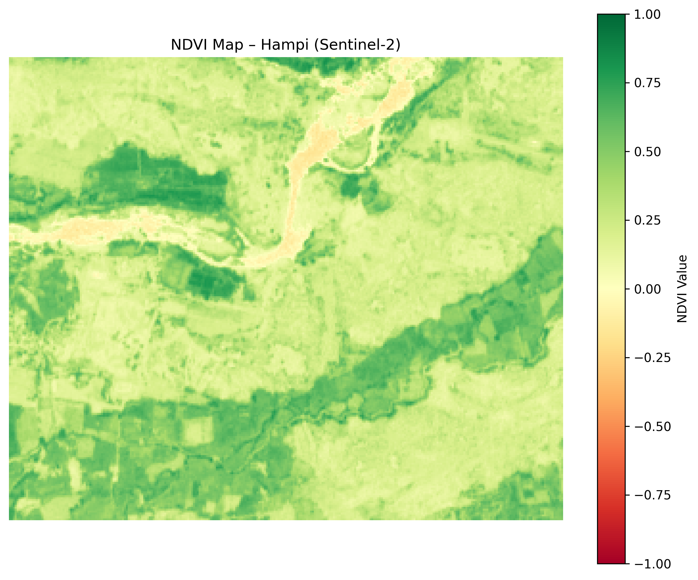

# NDVI-Based Vegetation Masking – Archaeological Site of Hampi, India

This project demonstrates the use of NDVI (Normalized Difference Vegetation Index) to identify and mask vegetated areas around the Hampi Group of Monuments (UNESCO World Heritage Site) using Sentinel-2 satellite imagery and Python.

## 🏛️ Introduction

Remote sensing techniques like NDVI (Normalized Difference Vegetation Index) are increasingly used in archaeological research to detect, monitor, and manage cultural landscapes. Vegetation patterns can both obscure and indicate the presence of archaeological features — particularly in large, complex, or partially overgrown sites.

This project applies NDVI-based vegetation analysis to the UNESCO World Heritage site of **Hampi**, Karnataka, India. The Hampi region, with its expansive layout of temples, shrines, roads, and agricultural remains, is partly covered by seasonal vegetation. This vegetation can:

- Obscure surface-visible remains and pathways during field surveys
- Prevent effective aerial photogrammetry or LiDAR scans
- Indicate areas where subsurface architecture or infrastructure might be preserved

By calculating NDVI from Sentinel-2 imagery and generating a vegetation mask (NDVI > 0.4), this project helps:

- Identify zones where **dense vegetation** may conceal archaeological features
- Prioritize areas for **ground-based or UAV-based** investigation
- Support **non-invasive monitoring** of vegetative change over time
- Establish a baseline for **multi-temporal comparison** (e.g., wet vs dry season visibility)

In the context of heritage management, this workflow enables low-cost, scalable landscape monitoring for large sites like Hampi — a critical task in regions facing tourism pressure, encroachment, and environmental change.

## 📍 Study Area

- **Location**: Hampi, Karnataka, India
- **Coordinates**: approx. 15.3350° N, 76.4619° E
- **AOI**: Manually defined polygon enclosing the core monument zone

## 🎯 Objective

To calculate NDVI from Sentinel-2 bands and generate a vegetation mask that highlights areas with NDVI > 0.4 (dense vegetation), potentially obscuring archaeological features.

## 🛰️ Data Used

| Source | Description |
|--------|-------------|
| Sentinel-2 (L2A) | Band 4 (Red) and Band 8 (NIR), 10m resolution |
| GeoJSON AOI | Custom-drawn boundary around Hampi monuments |

## 🛠️ Tools and Libraries

- QGIS (AOI generation, visualization)
- Python 3.8
  - `rasterio`, `numpy`, `matplotlib`

## 🔄 Workflow

1. Download Sentinel-2 bands for Hampi from [Sentinel Hub EO Browser](https://apps.sentinel-hub.com/eo-browser/)
2. Clip B04 and B08 rasters to AOI
3. Calculate NDVI: `(NIR - Red) / (NIR + Red)`
4. Generate vegetation mask: NDVI > 0.4
5. Visualize and export results

## 🖼️ Outputs

| Output File | Description |
|-------------|-------------|
| `ndvi_hampi.tiff` | NDVI GeoTIFF |
| `ndvi_hampi.png` | NDVI visualization |
| `vegetation_mask.tiff` | Binary vegetation mask (GeoTIFF) |
| `vegetation_mask.png` | Binary mask visualization |

## 🌿 NDVI Preview

---

