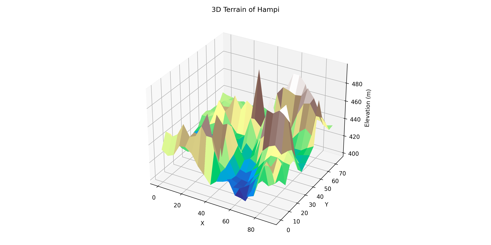
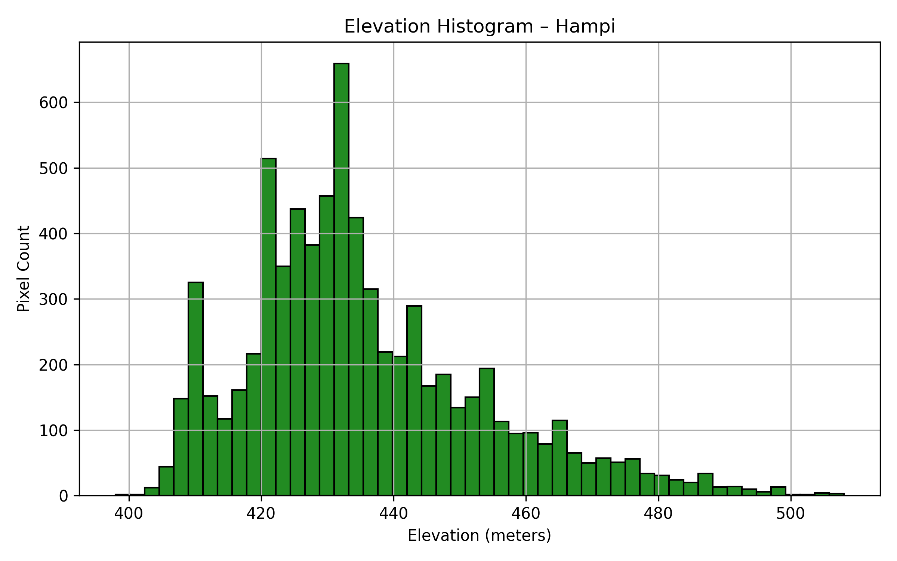

# Terrain Analysis of Hampi Using DEM

This project performs a terrain analysis of the UNESCO World Heritage Site of Hampi using publicly available SRTM elevation data. It demonstrates how elevation, slope, and terrain direction (aspect) contribute to archaeological interpretation.

---

## 🏛️ Introduction

Understanding terrain is fundamental to archaeological interpretation, especially in complex cultural landscapes like Hampi. The site covers a vast area of boulder-strewn hills, riverbanks, and valleys — all of which influenced where structures were built and how people moved through the landscape.

This project uses a Digital Elevation Model (DEM) to generate:

- 🌄 **3D terrain visualizations**: Helps visualize the natural setting of monuments
- 🧭 **Slope and aspect maps**: Useful for understanding visibility, erosion, and settlement planning
- 📊 **Elevation histograms**: Reveal how site planning was distributed across terrain levels

These insights can assist in:
- Identifying natural chokepoints, processional routes, or visibility lines
- Prioritizing areas for survey or excavation based on terrain difficulty
- Modeling ancient water flow, temple tank placement, and defensive strategies

By combining hillshade, slope, and aspect layers, this analysis builds a geospatial foundation for future archaeological modeling and AI-based site detection.

---

## 📍 Study Area: Hampi, Karnataka, India

- Latitude: ~15.33° N
- Longitude: ~76.46° E
- AOI defined using `hampi_boundary.geojson`

---

## 🔄 Workflow Summary

1. **Download SRTM DEM** from [USGS EarthExplorer](https://earthexplorer.usgs.gov/) 
2. **Clip DEM to Hampi AOI** using QGIS
3. **Generate hillshade, slope, and aspect** layers in QGIS
4. **Visualize 3D terrain & elevation histogram** using Python
5. **Document archaeological relevance of terrain** for site planning

---

## 🖥️ Tools Used

- QGIS 3.40.1
- Python 3.8+
- Libraries: `rasterio`, `matplotlib`, `numpy`
- Data: SRTM 30m DEM

---

## 📊 Outputs

- `hillshade.tif`: Simulated sunlight shading
- `slope.tif`: Degree of terrain steepness
- `aspect.tif`: Compass direction of terrain slope
- `3d_terrain.png`: 3D surface plot of Hampi
- `elevation_histogram.png`: Histogram showing elevation distribution

---

## 🖼️ Output Preview

### 3D Terrain of Hampi

### Elevation Histogram

---
