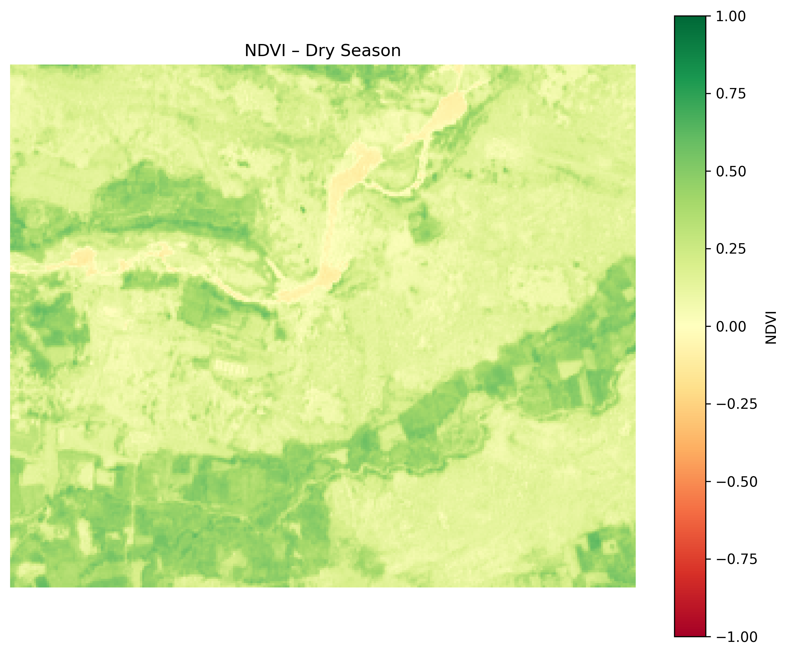
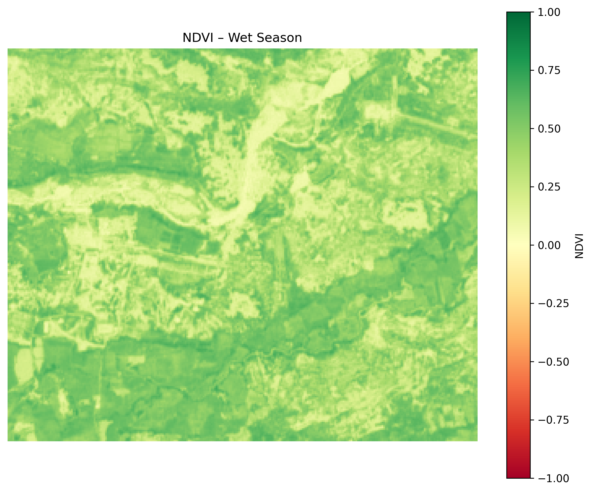
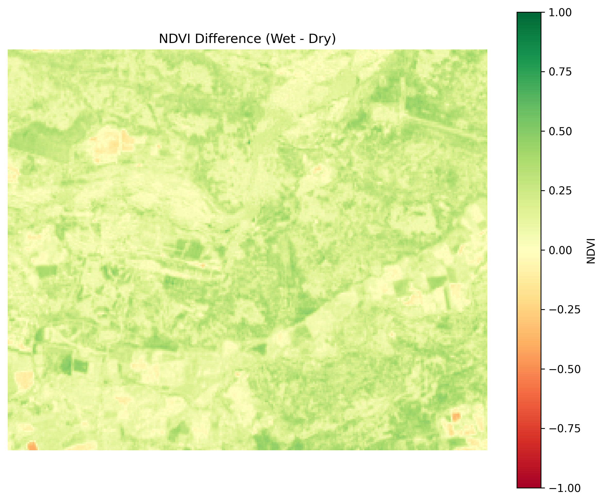
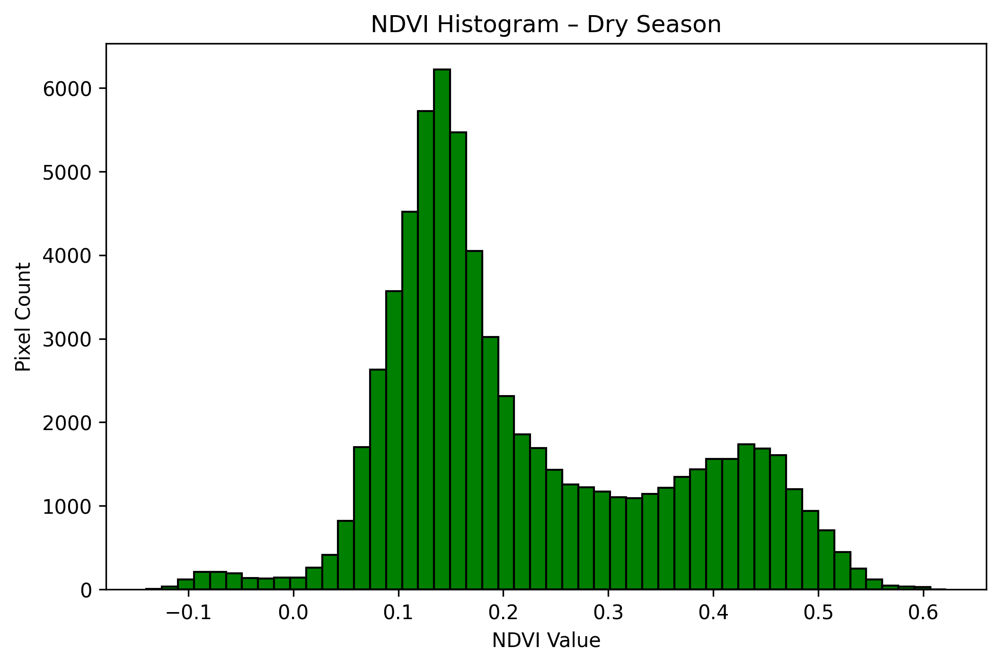
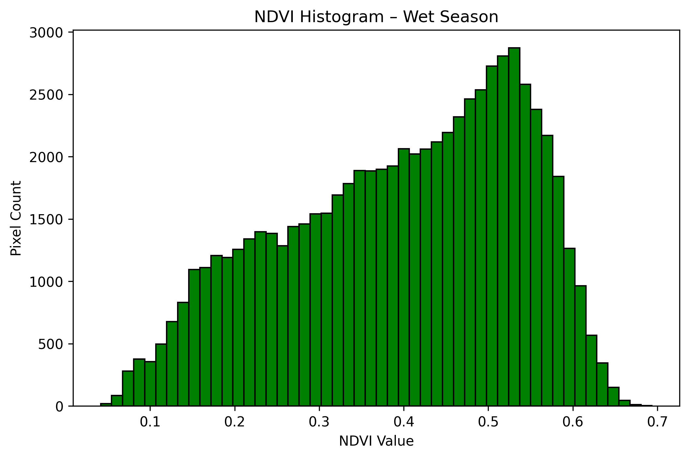
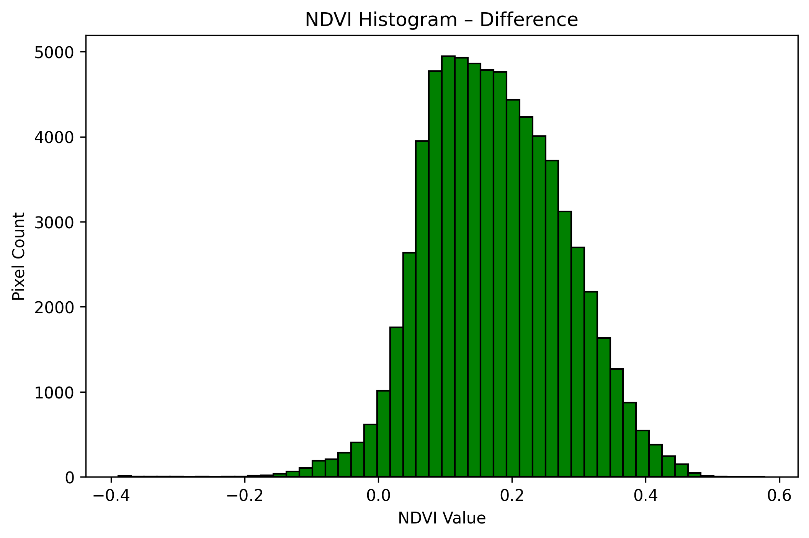

# NDVI Temporal Change Analysis – Archaeological Site of Hampi, India

This project analyzes **seasonal vegetation change** around the Hampi Group of Monuments (UNESCO World Heritage Site) using multi-temporal NDVI (Normalized Difference Vegetation Index) derived from Sentinel-2 imagery.

---

## 🏛️ Introduction

Temporal NDVI analysis is a valuable method in archaeological remote sensing. Vegetation patterns change across seasons, and this variability can reveal:

- Differences in **vegetation cover** affecting visibility of surface features
- **Human-altered zones** like ancient water management systems or fields
- **Optimal times** for UAV mapping or excavation

By comparing NDVI during dry and wet seasons, we can pinpoint areas where vegetation patterns fluctuate dramatically — potentially masking or revealing archaeological features.

This workflow can support:

- Non-invasive monitoring of site conditions
- Planning excavation or drone survey windows
- Detecting agricultural legacy systems and site boundaries

---

## 📍 Study Area

- **Location**: Hampi, Karnataka, India
- **Coordinates**: approx. 15.3350° N, 76.4619° E
- **AOI**: Manually drawn rectangle enclosing major monuments, tanks, and topographical features

---

## 🎯 Objective

To calculate NDVI for two different dates (wet and dry season), compute the difference, and visualize vegetation dynamics that may impact archaeological site analysis.

---

## 🛰️ Data Used

| Source | Description |
|--------|-------------|
| Sentinel-2 (L2A) | Band 4 (Red) and Band 8 (NIR), 10m resolution |
| GeoJSON AOI | Custom polygon boundary around Hampi core zone |

- **Dry season image**: 2024-02-05
- **Wet season image**: 2024-05-30

---

## 🛠️ Tools and Libraries

- QGIS (AOI definition, initial clipping)
- Python 3.8+
  - `rasterio`, `numpy`, `matplotlib`

---

## 🔄 Workflow

1. Download Sentinel-2 images from [Sentinel Hub EO Browser](https://apps.sentinel-hub.com/eo-browser/)
2. Clip Band 4 and Band 8 to AOI using QGIS
3. Compute NDVI for:
   - Dry season
   - Wet season
4. Subtract NDVI (Wet - Dry) to get temporal change map
5. Generate histograms and color maps for interpretation

---

## 🧩 Scripts Overview

This project is organized for modularity and reuse. The following scripts are used:

| Script | Description |
|--------|-------------|
| `ndvi_calculator.py` | Contains functions to calculate NDVI and the difference between two NDVI rasters using Sentinel-2 Band 4 and Band 8. |
| `ndvi_visualise.py` | Contains `visualize_ndvi()` function to render and export NDVI maps with consistent color scales and titles. |
| `paths_to_data_results.py` | Centralized file that defines paths to all input/output files (e.g., data, results). Keeps code clean and reusable. |
| `ndvi_generate.ipynb` | Jupyter notebook to calculate NDVI for wet and dry seasons and compute their difference. |
| `ndvi_analyse.ipynb` | Jupyter notebook to visualize NDVI outputs (maps and histograms) using consistent color schemes. |

---

## 🖼️ Outputs

| Output | Description |
|--------|-------------|
| `ndvi_hampi_dry.tif` | NDVI raster for dry season |
| `ndvi_hampi_wet.tif` | NDVI raster for wet season |
| `ndvi_diff.tif` | NDVI difference map (wet - dry) |
| `ndvi_hampi_dry.png` | NDVI map (dry season) |
| `ndvi_hampi_wet.png` | NDVI map (wet season) |
| `ndvi_diff_map.png` | NDVI difference map visualization |
| `histogram_dry.png` | Histogram of NDVI values (dry) |
| `histogram_wet.png` | Histogram of NDVI values (wet) |
| `histogram_diff.png` | Histogram of NDVI differences |

---

## 🌿 NDVI Maps

### Dry Season NDVI

### Wet Season NDVI

### NDVI Change Map (Wet - Dry)

---

## 📊 Histograms

### Dry Season Histogram

### Wet Season Histogram

### NDVI Difference Histogram

---

## 🧭 Relevance to Archaeology

Seasonal NDVI change supports archaeologists by:

- Highlighting **vegetation-obscured structures** during monsoon or dry periods
- Revealing **former agricultural zones** through patterns of regrowth
- Helping **schedule surveys or UAV flights** for maximum visibility
- Supporting **long-term heritage monitoring** and environmental impact assessments

This workflow can be adapted for any site with seasonal dynamics, particularly in monsoon-influenced regions like South India.
