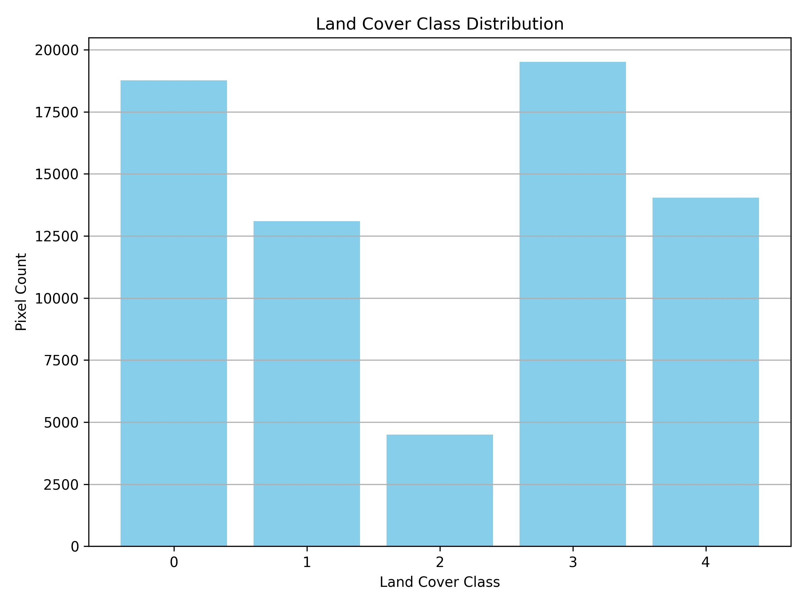

# Analysis – Land Cover Classification (Hampi)

This report provides an interpretation of the land cover classification results derived from Sentinel-2 imagery over the archaeological site of Hampi, India. The results where visualised in QGIS using the raster files generated during the project as well as through histograms. The aim is to asses these results from within the context of archaeological landscape analysis, and suggest directions for refinement.

## Histogram Analysis - Pixel Distribution by Class

The classification output assigned each pixel to one of five clusters (0–4). The histogram below shows the relative distribution:

| Class ID | Interpreted Category         | Pixel Count (Approx.) | Relative Area |
|----------|------------------------------|------------------------|---------------|
| 3        | Rocky Terrain                | 19,000                 | Largest land cover |
| 0        | Vegetation                   | 18,000                 | Extensive but seasonally dry |
| 4        | Built-up / Habitation        | 13,500                 | Moderate presence |
| 1        | Water                        | 13,000                 | Inflated by misclassifications |
| 2        | Mixed / Transitional         | 4,800                  | Least defined |

---

## GIS Visualisation Analysis - Interpretation of Classes

The table below outlines the interpreted categories based on visual inspection of the classified raster in QGIS, highlighting where each class appears and any visible misclassifications.

| Class ID | Likely Category               | Interpretation                                                                 |
|----------|-------------------------------|---------------------------------------------------------------------------------|
| 0        | **Vegetation**                | Dominates cultivated zones and open fields; little shrubbery in rocky zones detected. Most accurate class. |
| 1        | **Water**                     | Correctly identifies the **Tungabhadra River** and **Manmatha Tank**, but often misclassifies reflective rock faces as water. |
| 2        | **Mixed / Transitional**      | Scattered class in transitional and fragmented zones — possibly includes sparse vegetation, gravel paths, or degraded land. |
| 3        | **Rocky Terrain**             | Captures some granitic outcrops but fails to identify many rocky patches north of the river. |
| 4        | **Built-up / Habitation**     | Successfully marks modern habitation and all the major temple complexes, though overlaps with exposed soil and unpaved surfaces. A few major temple ruins missclassified as mixed |

---

## Key Observations

### 1. Dominance of Exposed Terrain
- **Rocky terrain (Class 3)** dominates the landscape in April.
- This aligns with seasonal dryness and exposure of granitic outcrops in Hampi's topography.
- **Vegetation (Class 0)** is still relatively high, likely due to irrigated agriculture, but sparse in transitional hill areas.

### 2. Misclassification in Water Bodies
- The **Tungabhadra River** and **tanks** are well mapped, but **class 1** also captures shaded or smooth rock surfaces.
- This misclassification is expected due to spectral similarities* between still water and shaded terrain in the near-infrared and red bands.

### 3. Archaeological Visibility
- **Built-up/habitation zones (Class 4)** correspond well with temple complexes and settlement clusters.
- However, there's **confusion with bare soil**, indicating the need for refined classification (e.g., supervised models or additional bands like SWIR).

---

## Seasonal Context – April 

- The **dry season imagery** (April) provides **clear visibility** over archaeological remains due to sparse vegetation.
- However, **early dry season** vegetation (e.g., irrigated crops) still influences classification.
- Future improvement can be made by **comparing with wet-season NDVI maps** (see Project 4) to isolate **seasonal vs. permanent land cover types**.

---

## Strengths

- Terrain patterns (rocky hills, water bodies, vegetation) are broadly distinguishable despite seasonal dryness.
- Offers a low-cost, scalable approach using only open-access Sentinel-2 imagery.
- Some zones (e.g., vegetation, major water bodies, built-up clusters) are reasonably well captured in spatial context.

---

## Limitations

- **Spectral confusion** between rocky surfaces and water due to similar reflectance in NIR bands under certain lighting conditions.
- **Built-up and bare soil** classes (e.g., temple platforms, exposed fields) overlap heavily due to dry seasonal reflectance.
- **Mixed class (Class 2)** lacks clarity, containing a blend of disturbed or transitional zones that are difficult to define.
- Unsupervised clustering **lacks contextual knowledge**, leading to misclassified archaeological areas (e.g., monuments labeled as mixed/transitional or water).

---

## 🔧 Suggestions for Improvement

1. **Apply Supervised Classification**
   - Train with hand-labeled data (e.g., known temples, tanks, vegetation patches) to improve thematic accuracy.

2. **Incorporate Additional Bands or Indices**
   - Add **SWIR (Band 11)** to better separate rocky vs. water zones.
   - Integrate **NDVI/NDWI** for more robust vegetation and water delineation.

3. **Seasonal Layer Comparison**
   - Use wet-season imagery to assess shifts in vegetation, water spread, or cultivation areas.
   - Helps identify **seasonally hidden features**, such as dried tanks or post-harvest plots.

4. **Manual Post-Classification Refinement**
   - Visually inspect and merge classes using archaeological context (e.g., correcting temple zones misclassified as bare soil).

5. **Overlay with Archaeological Layers**
   - Add layers of **temples, tanks, pathways, field systems** to assess spatial correlation with classified terrain types.

---

## 🏺 Archaeological Relevance

This land cover classification, even if coarse, offers several benefits:

- Acts as a **baseline map** to support field planning, drone flight paths, or sensor deployment.
- Highlights **spatial clustering** of temples, habitation, and water access, aiding **interpretation of site layout and land use**.
- Reveals **potential zones of concern**, such as urban encroachment or vegetation loss.
- Enables **non-invasive monitoring** of environmental changes around vulnerable heritage features.

While improvements are needed for precision, the current method supports scalable, replicable landscape assessments across archaeological sites in India.

